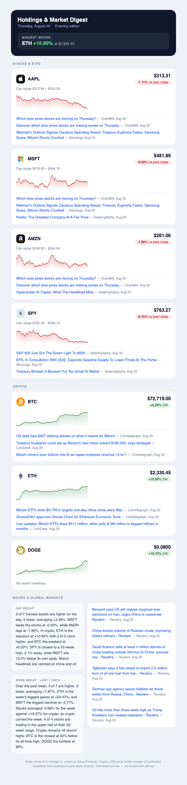

# Holdings & Market Digest

**A free, self-hosted email digest that tracks any stocks and crypto you care
about — twice a day, in one email, with charts and news.**

No app to install. No account to create. No subscription. It runs itself in the
cloud for free and emails you at market open (9:30am ET) and market close
(4:00pm ET) — every day, weekends included.

> ⚠️ Informational only — this is **not** investment advice. Please read the
> **[DISCLAIMER](DISCLAIMER.md)** before using it, especially the section on
> handling your credentials safely.

---

## What it looks like

Every edition includes price, percent change, a chart, and headlines for each
ticker, plus day/week recaps and macro news at the bottom:

<p align="center">
  
</p>

*(Sample tickers shown — you set your own.)*

---

## What you get

- **Every ticker you follow** — stocks, ETFs, and crypto side by side, with
  price, percent change, day range, and a sparkline chart of recent action
- **News per ticker** — recent headlines from business sources, linked
- **Biggest mover** highlighted at the top of every email
- **Day recap** — breadth, leaders and laggards, 52-week positioning
- **Week recap** — 7-day performance, stocks vs. crypto, distance from highs
- **Macro headlines** — Fed, inflation, rates, tariffs, and other market movers

## Why it exists

Following a handful of tickers means opening several apps, each designed to keep
you scrolling rather than to inform you. This sends one email at the two moments
that matter, then leaves you alone. **[Read ABOUT.md](ABOUT.md)** for the full
reasoning and design decisions.

---

## Set it up (about 10 minutes, free)

### 1. Make your own copy

Click **Use this template** (or **Fork**) at the top of this repo. Keep your
copy **private** — it's yours.

### 2. Choose your tickers

Edit [`watchlist.json`](watchlist.json):

```json
{
  "stocks": ["AAPL", "MSFT", "AMZN", "SPY"],
  "crypto": ["BTC", "ETH", "DOGE"],
  "news_per_ticker": 3,
  "macro_news": 6
}
```

Adding a ticker is one line — it automatically gets a price, chart, logo, and
headlines. Any US stock or ETF works; crypto symbols are looked up
automatically.

### 3. Get a free Finnhub key

Sign up at **[finnhub.io](https://finnhub.io)** and copy your API key. The free
tier is plenty for this.

### 4. Create a Gmail App Password

The digest sends from your own Gmail. You need an **App Password**, not your
normal password:

1. Turn on 2-Step Verification on your Google account
2. Go to **[myaccount.google.com/apppasswords](https://myaccount.google.com/apppasswords)**
3. Create one named e.g. "market digest" and copy the 16 characters

An App Password can only send mail and can be revoked anytime without affecting
your account.

### 5. Add your three secrets

In **your** repo: **Settings → Secrets and variables → Actions → New repository
secret**. Add these three:

| Secret name | Value |
|---|---|
| `FINNHUB_API_KEY` | your Finnhub key |
| `GMAIL_ADDRESS` | your Gmail address |
| `GMAIL_APP_PASSWORD` | your 16-character App Password |

Secrets are encrypted, hidden from the code, and masked in logs. Optionally add
`DIGEST_TO` to send the digest somewhere other than your own inbox.

### 6. Send a test

Go to the **Actions** tab → **Holdings and Market Digest** → **Run workflow**.
Check your inbox in a minute or two.

That's it. From then on it arrives automatically every weekday morning and
evening.

---

## Try it locally first (optional)

Preview the email in your browser without sending anything:

```bash
cp .env.example .env      # then fill in your values
set -a && source .env && set +a
DRY_RUN=1 python3 main.py # writes preview.html
```

## Schedule

Two emails **every day**, weekends included (crypto doesn't take weekends off):

| Edition | Target |
|---|---|
| Morning | 9:30am ET — market open |
| Evening | 4:00pm ET — market close |

**How the timing works.** GitHub Actions cron is best-effort and is often late —
delays of minutes to several hours are normal — so a single cron can't land on a
target time. Instead the workflow schedules many attempts after each target,
`main.py --schedule-check` only lets a run proceed at or after a target, and an
Actions cache marker (keyed date + edition) guarantees exactly one email per
edition. Whichever attempt GitHub actually runs first wins; the rest exit in
seconds. Bands cover both EDT and EST, so daylight saving needs no adjustment.

To change the targets, edit `MARKET_OPEN` / `MARKET_CLOSE` in
[`main.py`](main.py) and the matching `cron` bands in
[`.github/workflows/daily.yml`](.github/workflows/daily.yml) (UTC).

## How it works

- **Stocks** — [Finnhub](https://finnhub.io) for quotes and company news,
  Yahoo for intraday and 52-week data
- **Crypto** — [CoinGecko](https://www.coingecko.com), no API key required
- **Charts** — PNG sparklines generated in pure Python and embedded inline
  (email clients strip JavaScript and SVG)
- **Scheduling** — GitHub Actions, free tier
- **Dependencies** — none; Python standard library only

## Cost

$0. Every data source is a free tier, and GitHub Actions covers the scheduling.

## Troubleshooting

- **"Missing required environment variable"** — a secret name is missing or
  misspelled; they're case-sensitive
- **SMTP authentication error** — use a Gmail *App Password*, not your login
  password, with 2-Step Verification enabled
- **"no quote" on a ticker** — the symbol may be non-US or not covered by the
  free tier; check the symbol
- **Workflow didn't run** — GitHub pauses scheduled workflows in repos with no
  activity for 60 days; open the Actions tab and re-enable it
